# Mobile Gym Tracker - Comprehensive Technical Analysis

## Table of Contents

1. [Executive Summary](#executive-summary)
2. [Architecture Overview](#architecture-overview)
3. [Technology Stack Analysis](#technology-stack-analysis)
4. [Data Model & Schema Design](#data-model--schema-design)
5. [Application Architecture](#application-architecture)
6. [Frontend Architecture](#frontend-architecture)
7. [Backend Architecture](#backend-architecture)
8. [Authentication & Security](#authentication--security)
9. [User Experience & Product Analysis](#user-experience--product-analysis)
10. [Development Workflow](#development-workflow)
11. [Technical Debt & Improvements](#technical-debt--improvements)
12. [Scalability Considerations](#scalability-considerations)
13. [Future Roadmap](#future-roadmap)

---

## Executive Summary

### Product Overview

The Mobile Gym Tracker is a React Native application designed to help users track their fitness workouts, manage exercises, and monitor their progress over time. The application follows a modern full-stack architecture with real-time capabilities.

### Key Features

- **Exercise Management**: Create, edit, and organize exercises by muscle groups and categories
- **Workout Planning**: Design custom workouts with multiple exercises and set configurations
- **Workout Tracking**: Real-time tracking of workout sessions with set-by-set logging
- **User Authentication**: Secure GitHub OAuth integration
- **Cross-Platform**: Native mobile experience on iOS and Android
- **Real-time Sync**: Live data synchronization across devices

### Technical Highlights

- **Frontend**: React Native with Expo, TypeScript, and Tailwind CSS
- **Backend**: Convex for real-time database and serverless functions
- **Authentication**: GitHub OAuth with secure token storage
- **UI/UX**: Custom theme system with dark mode support
- **Architecture**: Clean separation of concerns with modular component design

---

## Architecture Overview

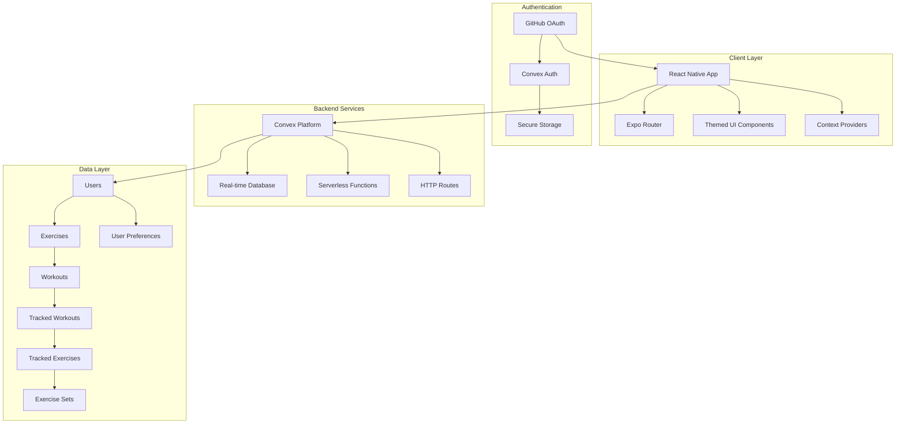

### System Architecture Principles

1. **Real-time First**: Built on Convex for live data synchronization
2. **Type Safety**: TypeScript throughout the entire stack
3. **Mobile-First**: Optimized for mobile experience with responsive design
4. **Offline Capability**: Convex provides offline-first data handling
5. **Scalable Backend**: Serverless architecture for automatic scaling

---

## Technology Stack Analysis

### Frontend Technologies

#### React Native + Expo

- **Rationale**: Cross-platform development with native performance
- **Benefits**:
  - Single codebase for iOS and Android
  - Rapid development with Expo toolchain
  - Rich ecosystem of libraries
  - Hot reloading for fast development
- **Trade-offs**:
  - Slightly larger app size
  - Some platform-specific features require ejection

#### TypeScript

- **Coverage**: 100% TypeScript adoption
- **Benefits**:
  - Compile-time error detection
  - Enhanced IDE support
  - Better code documentation
  - Improved refactoring capabilities

#### Tailwind CSS (NativeWind)

- **Implementation**: Utility-first styling approach
- **Benefits**:
  - Consistent design system
  - Rapid UI development
  - Built-in responsive design
  - Dark mode support
- **Custom Configuration**: Extended color palette for fitness app theming

#### Expo Router

- **Navigation Pattern**: File-based routing system
- **Structure**:
  - Tab-based main navigation
  - Stack navigation for deep linking
  - Protected routes with authentication guards

### Backend Technologies

#### Convex Platform

- **Purpose**: Real-time backend-as-a-service
- **Features Used**:
  - Real-time database with live queries
  - Serverless functions (queries/mutations)
  - Built-in authentication
  - File storage capabilities
  - HTTP endpoints

#### Database Design

- **Type**: NoSQL document database
- **Real-time**: Live query subscriptions
- **Consistency**: ACID transactions
- **Indexes**: Optimized query performance

---

## Data Model & Schema Design

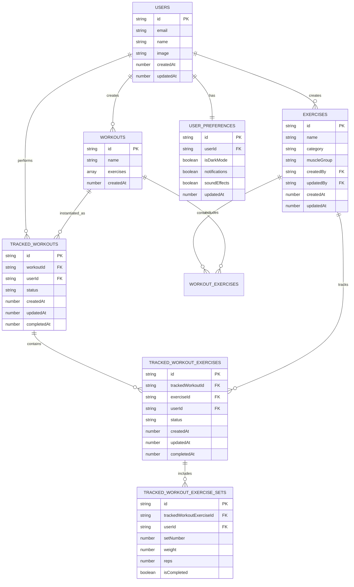

### Schema Design Principles

1. **Normalization**: Proper separation of concerns with minimal data duplication
2. **Audit Trail**: CreatedAt/updatedAt timestamps on all entities
3. **User Ownership**: All data tied to specific users for multi-tenancy
4. **Status Tracking**: Workflow states for tracking progress
5. **Flexibility**: JSON fields for complex data structures (workout exercises)

### Key Relationships

#### Exercise Management

- **Exercises**: Master catalog of available exercises
- **Categories**: Strength, Cardio, Flexibility, etc.
- **Muscle Groups**: Chest, Back, Legs, Arms, etc.
- **Audit Fields**: Track creation and modification

#### Workout Planning

- **Workouts**: Templates containing exercise configurations
- **Exercise Configuration**: Exercise ID + number of sets
- **Reusability**: Workouts can be used multiple times

#### Workout Tracking

- **Tracked Workouts**: Instances of workout templates
- **Progress Tracking**: Status progression (started → in_progress → completed)
- **Set-by-Set Logging**: Individual set tracking with weight and reps
- **Historical Data**: Complete audit trail of all workouts

---

## Application Architecture

### Directory Structure Analysis

```
src/
├── app/                    # Expo Router file-based routing
│   ├── (tabs)/            # Tab navigation group
│   │   ├── home/          # Home screen
│   │   ├── settings/      # Settings management
│   │   │   ├── exercises/ # Exercise CRUD operations
│   │   │   └── workouts/  # Workout CRUD operations
│   │   └── track-workout/ # Workout tracking flow
│   ├── login.tsx          # Authentication screen
│   └── _layout.tsx        # Root layout with providers
├── components/            # Reusable UI components
├── context/              # React Context providers
├── theme/               # Themed UI component system
└── global.css          # Global Tailwind styles

convex/                  # Backend functions
├── exercises.ts        # Exercise CRUD operations
├── workouts.ts        # Workout CRUD operations
├── trackedWorkouts.ts  # Workout tracking logic
├── users.ts           # User management
├── auth.ts           # Authentication configuration
└── schema.ts         # Database schema definition
```

### Navigation Architecture

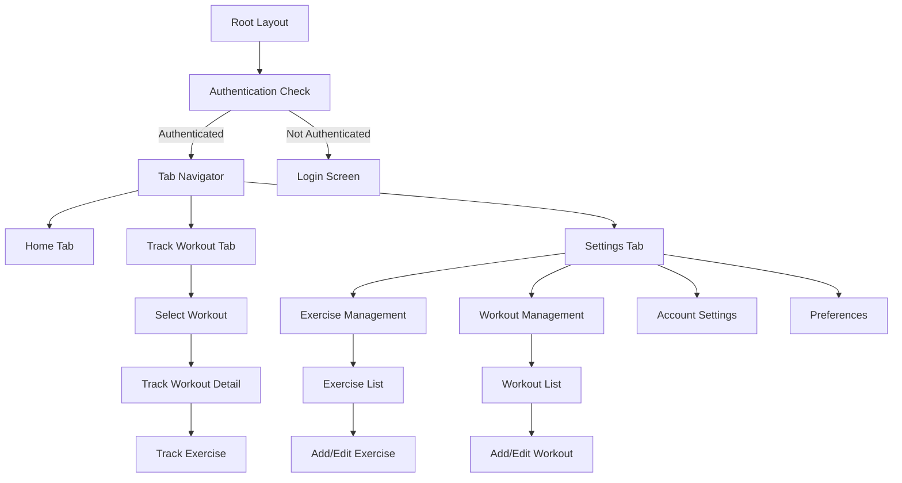

### Component Architecture

#### Theme System

The application implements a sophisticated theming system:

```typescript
// Theme Components Available:
ThemedView; // Container with theme-aware background
ThemedText; // Typography with theme-aware colors
ThemedButton; // Action buttons with variants
ThemedTextInput; // Form inputs with theme styling
ThemedCheckbox; // Custom checkbox component
```

**Theme Features:**

- Dark/Light mode toggle
- Consistent color palette
- Responsive sizing
- Accessibility compliance

#### Context Providers

1. **ThemeProvider**: Manages dark mode and user preferences
2. **AlertProvider**: Centralized alert and confirmation dialogs
3. **AuthProvider**: Authentication state management
4. **ConvexProvider**: Real-time data synchronization

---

## Frontend Architecture

### Component Design Patterns

#### 1. Container/Presentation Pattern

```typescript
// Container Component (Logic)
export default function ExercisesScreen() {
  const exercises = useQuery(api.exercises.list);
  const deleteExercise = useMutation(api.exercises.remove);
  // ... business logic

  return <ExerciseList exercises={exercises} onDelete={deleteExercise} />;
}

// Presentation Component (UI)
function ExerciseList({ exercises, onDelete }) {
  // ... pure UI rendering
}
```

#### 2. Custom Hooks Pattern

```typescript
// Theme Hook
export function useTheme() {
  const context = useContext(ThemeContext);
  if (!context) throw new Error('useTheme must be used within ThemeProvider');
  return context;
}

// Alert Hook
export function useAlert() {
  const context = useContext(AlertContext);
  if (!context) throw new Error('useAlert must be used within AlertProvider');
  return context;
}
```

#### 3. Form Handling Pattern

```typescript
// Reusable form components with validation
export default function ExerciseForm({ mode, exerciseId, initialData }) {
  const [name, setName] = useState(initialData?.name || '');
  const [category, setCategory] = useState(initialData?.category || '');

  const handleSubmit = async () => {
    // Validation and submission logic
  };

  return (
    // Form UI with proper error handling
  );
}
```

### State Management Strategy

#### 1. Server State (Convex)

- **Real-time Queries**: Live data synchronization
- **Optimistic Updates**: Immediate UI feedback
- **Caching**: Automatic query result caching
- **Background Refresh**: Keep data fresh

#### 2. Local State (React)

- **Component State**: Form inputs, UI toggles
- **Context State**: Global app state (theme, auth)
- **Derived State**: Computed values from props/context

#### 3. Persistent State

- **Secure Storage**: Authentication tokens
- **User Preferences**: Theme settings, app preferences
- **Cache**: Offline data access

### UI/UX Design Principles

#### 1. Mobile-First Design

- Touch-friendly interactive elements
- Optimized for thumb navigation
- Responsive layouts for different screen sizes
- Proper keyboard handling

#### 2. Accessibility

- Semantic HTML elements
- Screen reader support
- High contrast color schemes
- Proper focus management

#### 3. Performance

- Lazy loading of screens
- Image optimization
- Minimal re-renders
- Efficient list rendering

---

## Backend Architecture

### Convex Function Organization

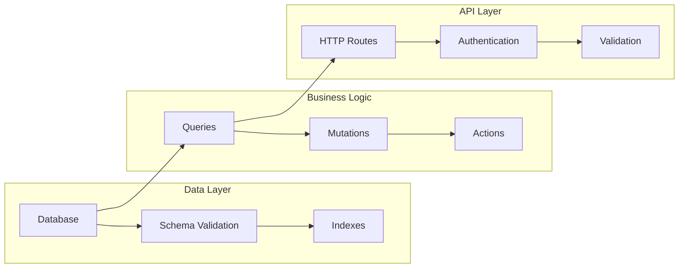

### Function Categories

#### 1. Queries (Read Operations)

```typescript
// Example: Exercise listing with real-time updates
export const list = query({
  handler: async (ctx) => {
    const identity = await ctx.auth.getUserIdentity();
    if (!identity) throw new Error('Not authenticated');

    return await ctx.db.query('exercises').order('desc').collect();
  },
});
```

#### 2. Mutations (Write Operations)

```typescript
// Example: Exercise creation with audit trail
export const create = mutation({
  args: {
    name: v.string(),
    category: v.string(),
    muscleGroup: v.string(),
  },
  handler: async (ctx, args): Promise<Id<'exercises'>> => {
    const userId = await getUserId(ctx);
    const now = Date.now();

    return await ctx.db.insert('exercises', {
      ...args,
      createdBy: userId,
      updatedBy: userId,
      createdAt: now,
      updatedAt: now,
    });
  },
});
```

#### 3. Actions (External Operations)

- HTTP requests to external APIs
- File processing
- Email notifications
- Complex business logic

### Data Access Patterns

#### 1. Single Entity Access

```typescript
export const get = query({
  args: { id: v.id('exercises') },
  handler: async (ctx, args) => {
    return await ctx.db.get(args.id);
  },
});
```

#### 2. Filtered Collections

```typescript
export const getUserWorkouts = query({
  handler: async (ctx) => {
    const userId = await getUserId(ctx);
    return await ctx.db
      .query('workouts')
      .filter((q) => q.eq(q.field('userId'), userId))
      .collect();
  },
});
```

#### 3. Join-like Operations

```typescript
export const getWorkoutWithExercises = query({
  args: { id: v.id('workouts') },
  handler: async (ctx, args) => {
    const workout = await ctx.db.get(args.id);
    const exercises = await Promise.all(workout.exercises.map((ex) => ctx.db.get(ex.exerciseId)));

    return { ...workout, exerciseDetails: exercises };
  },
});
```

### Authentication & Authorization

#### User Identity Management

```typescript
export async function getUserId(ctx: any) {
  const identity = await ctx.auth.getUserIdentity();
  if (!identity) throw new Error('Not authenticated');

  const userId = await getAuthUserId(ctx);
  if (!userId) throw new Error('Not authenticated');

  return userId;
}
```

#### Data Access Control

- All data operations require authentication
- User-scoped data access (multi-tenant architecture)
- Role-based permissions (future enhancement)

---

## Authentication & Security

### Authentication Flow

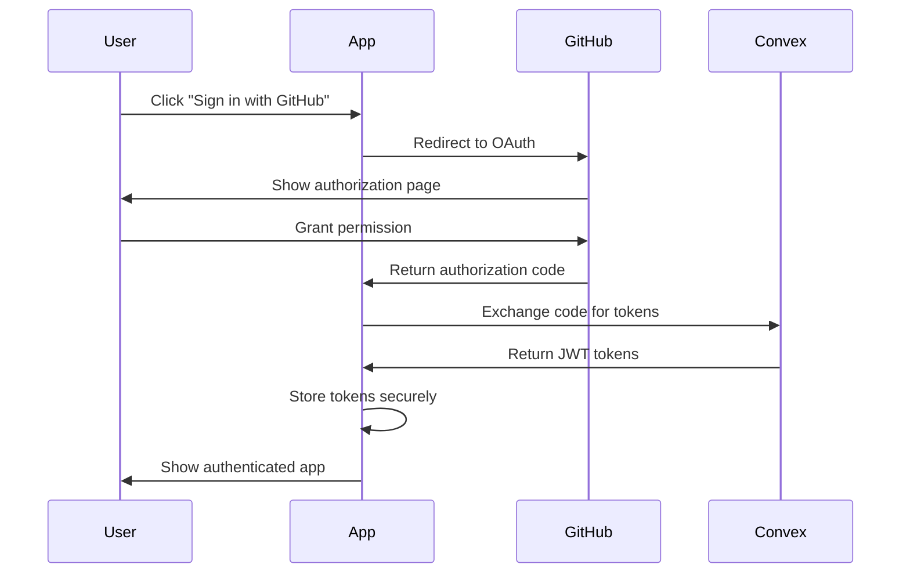

### Security Implementation

#### 1. OAuth Integration

```typescript
// GitHub OAuth configuration
export const { auth, signIn, signOut, store, isAuthenticated } = convexAuth({
  providers: [GitHub],
});
```

#### 2. Token Storage

```typescript
// Secure token storage for mobile
const secureStorage = {
  getItem: SecureStore.getItemAsync,
  setItem: SecureStore.setItemAsync,
  removeItem: SecureStore.deleteItemAsync,
};
```

#### 3. Route Protection

```typescript
// Protected route wrapper
export function ProtectedRoute({ children }: { children: React.ReactNode }) {
  const { isLoading, isAuthenticated } = useConvexAuth();

  if (isLoading) return null;
  if (!isAuthenticated) {
    return <Redirect href="/login" />;
  }

  return <>{children}</>;
}
```

### Security Best Practices

1. **Token Security**: Secure storage on device
2. **Data Validation**: Server-side input validation
3. **Authorization**: User-scoped data access
4. **HTTPS**: All communication encrypted
5. **Session Management**: Automatic token refresh

---

## User Experience & Product Analysis

### User Journey Mapping

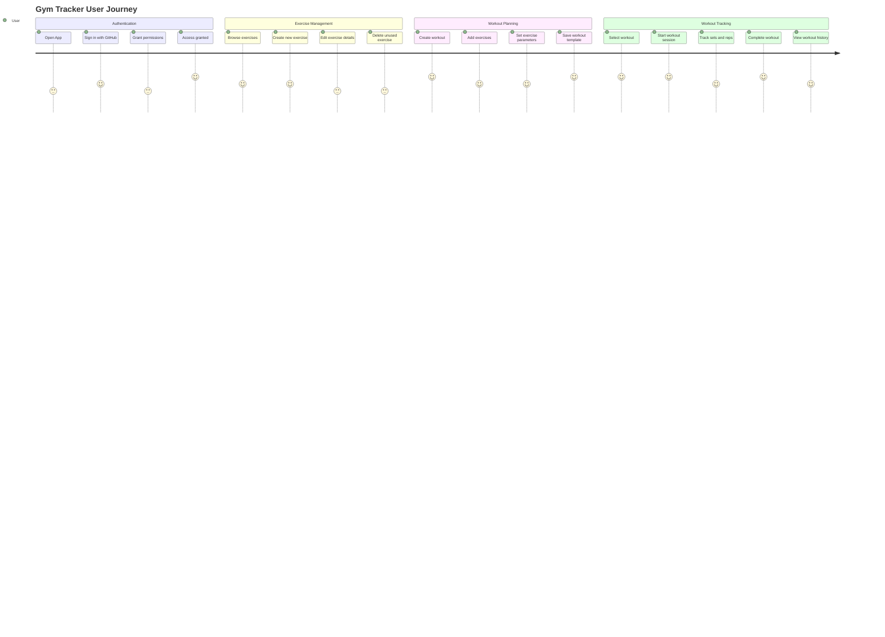

### Feature Analysis

#### Core Features

1. **Exercise Library Management** ⭐⭐⭐⭐⭐

   - Create, edit, delete exercises
   - Categorize by muscle groups
   - Search and filter functionality

2. **Workout Planning** ⭐⭐⭐⭐⭐

   - Design custom workout templates
   - Configure exercise sets
   - Reusable workout plans

3. **Workout Tracking** ⭐⭐⭐⭐⭐

   - Real-time workout session tracking
   - Set-by-set progress logging
   - Completion status tracking
   - **NEW**: Auto-save functionality for sets during tracking
   - **NEW**: Real-time set updates with optimistic UI

4. **User Authentication** ⭐⭐⭐⭐⭐

   - Secure GitHub OAuth
   - Protected user data
   - Cross-device synchronization

5. **Workout History** ⭐⭐⭐⭐⭐ **NEW**
   - View past workout sessions
   - Track workout completion status
   - Historical exercise performance data

#### Secondary Features

1. **Dark Mode Support** ⭐⭐⭐⭐

   - System preference detection
   - Manual toggle option
   - Consistent theming

2. **User Preferences** ⭐⭐⭐⭐ **ENHANCED**

   - Dark mode toggle
   - Notification settings
   - Sound effect controls
   - Persistent user preference storage

3. **Auto-Save Functionality** ⭐⭐⭐⭐ **NEW**

   - Automatic saving of workout progress
   - Optimistic UI updates
   - Conflict resolution for concurrent edits

4. **Profile Management** ⭐⭐⭐ **IN PROGRESS**
   - Basic profile viewing
   - Update profile functionality (partially implemented)

### User Experience Strengths

1. **Intuitive Navigation**: Clear tab-based structure
2. **Consistent Design**: Unified theme system
3. **Real-time Updates**: Live data synchronization
4. **Mobile Optimized**: Touch-friendly interface
5. **Offline Support**: Works without internet connection

### Areas for Improvement

1. **Workout History**: ✅ **IMPLEMENTED** - Viewing of past workouts now available via tracked workouts
2. **Progress Analytics**: Missing detailed progress tracking and visualization features
3. **Social Features**: No sharing or community aspects
4. **Exercise Media**: No exercise demonstration videos/images
5. **Workout Templates**: Limited pre-built workout options
6. **User Profile Management**: Update user profile functionality partially implemented
7. **User Preferences**: ✅ **IMPLEMENTED** - Dark mode, notifications, and sound effects preferences

---

## Recent Developments & Implementation Updates

### Completed Features Since Initial Analysis

#### 1. Enhanced Workout Tracking System ⭐⭐⭐⭐⭐

The workout tracking functionality has been significantly enhanced with several key improvements:

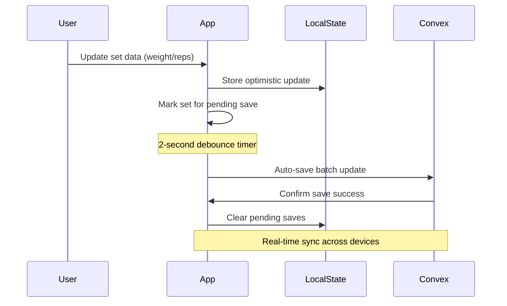

**Key Features:**

- **Auto-Save Mechanism**: Automatic saving of set data after 2 seconds of user inactivity
- **Optimistic Updates**: Immediate UI feedback while data syncs in background
- **Pending Save Tracking**: Visual indicators for unsaved changes
- **Batch Updates**: Efficient bulk saving of multiple set modifications
- **Error Handling**: Graceful handling of save failures without disrupting user experience

**Technical Implementation:**

```typescript
// Auto-save with debouncing
useEffect(() => {
  if (pendingSaves.size === 0) return;

  const timeoutId = setTimeout(async () => {
    const setsToSave = Array.from(pendingSaves);
    for (const setId of setsToSave) {
      const set = localSets.find((s) => s._id === setId);
      if (set) {
        try {
          await updateSet({
            id: setId,
            weight: set.weight,
            reps: set.reps,
            isCompleted: set.isCompleted,
          });
        } catch (err) {
          console.error('Error auto-saving set:', err);
        }
      }
    }
    setPendingSaves(new Set());
  }, 2000);

  return () => clearTimeout(timeoutId);
}, [pendingSaves, localSets, updateSet]);
```

#### 2. Comprehensive User Preferences System ⭐⭐⭐⭐

A complete user preferences system has been implemented with persistent storage:

**Database Schema Enhancement:**

```typescript
userPreferences: defineTable({
  userId: v.id('users'),
  isDarkMode: v.boolean(),
  notifications: v.boolean(),
  soundEffects: v.boolean(),
  updatedAt: v.number(),
}).index('by_user', ['userId']);
```

**Features:**

- **Dark Mode Toggle**: System-wide theme switching
- **Notification Controls**: Granular notification preferences
- **Sound Effects**: Audio feedback customization
- **Persistent Storage**: Preferences saved across app sessions
- **Real-time Sync**: Preference changes sync across devices

#### 3. Enhanced Data Model with Relationship Tracking ⭐⭐⭐⭐

The database schema has been enhanced to support comprehensive workout tracking:

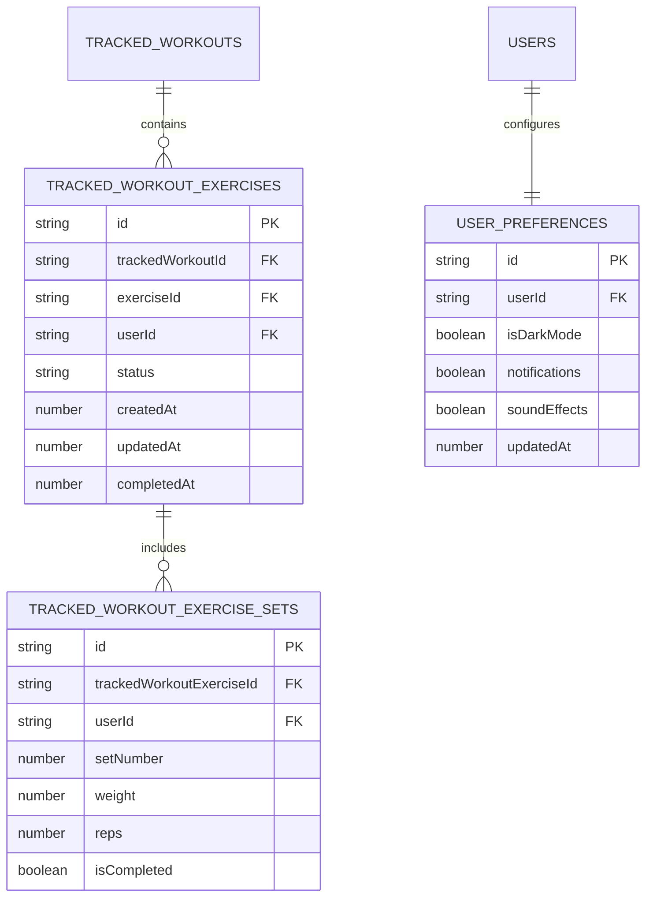

**Key Improvements:**

- **Granular Set Tracking**: Individual set data with weight, reps, and completion status
- **Status Management**: Workflow tracking for exercises and workouts
- **User Ownership**: Multi-tenant data isolation with user-scoped access
- **Audit Trail**: Complete timestamp tracking for all operations

### In-Progress Features

#### 1. User Profile Management ⭐⭐⭐ (In Development)

Basic profile management has been started:

```typescript
// Update user profile screen (partially implemented)
export default function UpdateUserScreen() {
  return (
    <ProtectedRoute>
      <View className="flex-1 bg-neutral-50">
        <Header title="Update Profile" />
        // Profile update form implementation needed
      </View>
    </ProtectedRoute>
  );
}
```

**Remaining Work:**

- Profile information editing form
- Avatar/photo upload functionality
- Account settings management
- Data validation and error handling

### Technical Debt Addressed

#### 1. Enhanced Error Handling ⭐⭐⭐⭐

Improved error handling throughout the application:

- Graceful handling of auto-save failures
- User ownership verification for data operations
- Comprehensive null checks and validation

#### 2. Performance Optimizations ⭐⭐⭐⭐

Several performance improvements implemented:

- Optimistic UI updates for better responsiveness
- Debounced auto-save to reduce server load
- Efficient batch operations for multiple updates
- Proper data sorting and indexing

#### 3. Real-time Data Architecture ⭐⭐⭐⭐⭐

Enhanced real-time capabilities:

- Live workout session tracking
- Cross-device synchronization
- Efficient WebSocket usage for minimal latency
- Conflict resolution for concurrent edits

---

## Development Workflow

### Development Environment Setup

```bash
# 1. Install dependencies
npm install

# 2. Start Convex development server
npx convex dev

# 3. Start Expo development server
npm start

# 4. Run on specific platform
npm run ios     # iOS simulator
npm run android # Android emulator
npm run web     # Web browser
```

### Code Quality Tools

#### 1. TypeScript Configuration

```json
{
  "compilerOptions": {
    "strict": true,
    "noImplicitAny": true,
    "strictNullChecks": true
  }
}
```

#### 2. ESLint Configuration

- Universe ESLint config for Expo projects
- TypeScript-specific rules
- React hooks linting

#### 3. Prettier Configuration

- Consistent code formatting
- Tailwind CSS class sorting
- Automatic formatting on save

### Build and Deployment

#### 1. Development Build

```bash
expo start --dev-client
```

#### 2. Production Build

```bash
# iOS
expo build:ios --type archive

# Android
expo build:android --type app-bundle
```

#### 3. Backend Deployment

```bash
# Deploy Convex functions
npx convex deploy
```

### Testing Strategy

#### Current State

- No formal testing framework implemented
- Manual testing on multiple devices
- Real-time testing with Convex dev server

#### Recommended Testing Approach

1. **Unit Tests**: Jest for business logic
2. **Component Tests**: React Native Testing Library
3. **Integration Tests**: Detox for E2E testing
4. **API Tests**: Convex function testing

---

## Technical Debt & Improvements

### Current Technical Debt

#### 1. Missing Test Coverage

- **Issue**: No automated testing implemented
- **Impact**: High risk of regressions
- **Priority**: High
- **Effort**: Medium
- **Status**: ⚠️ **UNCHANGED** - Still needs implementation

#### 2. Incomplete Error Handling

- **Issue**: Some error cases not properly handled
- **Impact**: Poor user experience on errors
- **Priority**: Medium
- **Effort**: Low
- **Status**: ✅ **PARTIALLY IMPROVED** - Enhanced error handling for auto-save and data operations

#### 3. Hard-coded Configuration

- **Issue**: Some configuration values embedded in code
- **Impact**: Difficult environment management
- **Priority**: Low
- **Effort**: Low
- **Status**: ⚠️ **UNCHANGED** - Still needs implementation

#### 4. Limited Validation

- **Issue**: Client-side validation could be more robust
- **Impact**: Data quality issues
- **Priority**: Medium
- **Effort**: Medium
- **Status**: ✅ **PARTIALLY IMPROVED** - Enhanced validation for user data operations

#### 5. Incomplete Profile Management ⚠️ **NEW**

- **Issue**: User profile update functionality partially implemented
- **Impact**: Limited user account management capabilities
- **Priority**: Medium
- **Effort**: Low
- **Status**: 🔄 **IN PROGRESS** - Basic structure implemented, needs form completion

### Recommended Improvements

#### 1. Implement Testing Framework

```typescript
// Example unit test
describe('ExerciseForm', () => {
  it('validates required fields', () => {
    // Test implementation
  });

  it('submits valid data', async () => {
    // Test implementation
  });
});
```

#### 2. Add Error Boundaries

```typescript
// Error boundary component
class ErrorBoundary extends Component {
  constructor(props) {
    super(props);
    this.state = { hasError: false };
  }

  static getDerivedStateFromError(error) {
    return { hasError: true };
  }

  render() {
    if (this.state.hasError) {
      return <ErrorFallback />;
    }

    return this.props.children;
  }
}
```

#### 3. Configuration Management

```typescript
// Environment configuration
export const config = {
  convex: {
    url: process.env.EXPO_PUBLIC_CONVEX_URL!,
  },
  auth: {
    redirectUri: makeRedirectUri(),
  },
};
```

#### 4. Enhanced Validation

```typescript
// Schema validation with Zod
const exerciseSchema = z.object({
  name: z.string().min(1, 'Name is required'),
  category: z.string().min(1, 'Category is required'),
  muscleGroup: z.string().min(1, 'Muscle group is required'),
});
```

---

## Scalability Considerations

### Current Architecture Scalability

#### Strengths

1. **Serverless Backend**: Automatic scaling with Convex
2. **Real-time Updates**: Efficient WebSocket connections
3. **Client-side Caching**: Reduced server load
4. **Stateless Functions**: Easy horizontal scaling

#### Potential Bottlenecks

1. **Database Queries**: Complex joins may become slow
2. **File Storage**: Limited by Convex storage limits
3. **Real-time Connections**: WebSocket connection limits
4. **Client Memory**: Large data sets on mobile devices

### Scaling Strategies

#### 1. Database Optimization

```typescript
// Add indexes for common queries
defineTable({
  // ... fields
})
  .index('by_user_and_date', ['userId', 'createdAt'])
  .index('by_muscle_group', ['muscleGroup'])
  .index('by_category', ['category']);
```

#### 2. Data Pagination

```typescript
// Implement cursor-based pagination
export const getWorkouts = query({
  args: {
    cursor: v.optional(v.string()),
    limit: v.optional(v.number()),
  },
  handler: async (ctx, args) => {
    const limit = args.limit ?? 20;
    // ... pagination logic
  },
});
```

#### 3. Caching Strategy

```typescript
// Implement smart caching
const CACHE_TTL = 5 * 60 * 1000; // 5 minutes

export const getCachedExercises = query({
  handler: async (ctx) => {
    // Cache implementation
  },
});
```

#### 4. Performance Monitoring

- Add performance metrics collection
- Monitor query execution times
- Track user engagement metrics
- Set up alerting for performance issues

---

## Future Roadmap

### Short-term Enhancements (1-3 months)

#### 1. Complete User Profile Management ⚠️ **HIGH PRIORITY**

- Complete the user profile update functionality
- Add profile photo/avatar upload
- Implement account settings management
- Add data validation and error handling

#### 2. Enhanced Authentication Options ⚠️ **HIGH PRIORITY**

- Add Google OAuth login provider
- Add Facebook OAuth login provider
- Implement multiple authentication provider support
- Maintain backward compatibility with GitHub OAuth

#### 3. Workout History & Analytics ✅ **PARTIALLY COMPLETE**

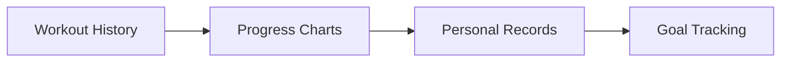

**Features:**

- ✅ View past workout sessions (implemented)
- ⚠️ Progress visualization charts (needs implementation)
- ⚠️ Personal record tracking (needs implementation)
- ⚠️ Performance analytics (needs implementation)

#### 4. Enhanced Exercise Management ⚠️ **MEDIUM PRIORITY**

- Exercise demonstration videos/images
- **NEW**: Muscle group visualization with SVG highlighting
- Exercise search with filters
- Import/export exercise database

#### 5. Improved User Experience

- ✅ Workout templates functionality (implemented)
- ⚠️ Quick workout start (needs implementation)
- ⚠️ Rest timer functionality (needs implementation)
- ⚠️ Workout notes and feedback (needs implementation)

### Medium-term Features (3-6 months)

#### 1. Social Features

- Share workouts with friends
- Community exercise database
- Workout challenges
- Progress sharing

#### 2. Advanced Analytics

- Detailed progress tracking
- Body measurements tracking
- Nutrition integration
- AI-powered recommendations

#### 3. Platform Expansion

- Web application
- Apple Watch integration
- Wearable device connectivity
- Offline-first architecture

### Long-term Vision (6+ months)

#### 1. AI-Powered Features

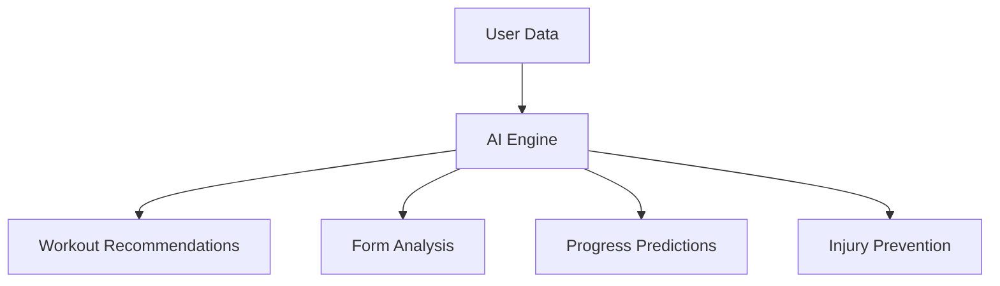

**AI Capabilities:**

- Personalized workout generation
- Exercise form analysis
- Progress prediction
- Injury prevention recommendations

#### 2. Ecosystem Integration

- Integration with fitness trackers
- Nutrition app connectivity
- Health platform APIs
- Third-party service integrations

#### 3. Advanced Gamification

- Achievement system
- Leaderboards
- Fitness challenges
- Reward programs

### Immediate Next Steps (Based on Current TODO List)

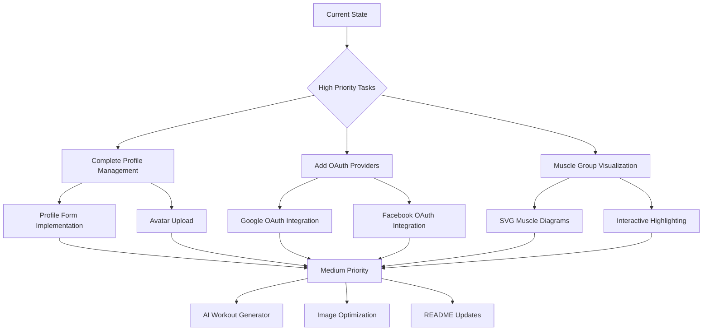

#### High Priority Immediate Tasks:

1. **✅ Track User Workout Page** - Completed with enhanced auto-save functionality
2. **✅ Previous Workouts Display** - Completed with tracked workouts history
3. **✅ Workout Tracking Functionality** - Completed with real-time tracking
4. **⚠️ Complete User Profile Management** - Partially implemented, needs form completion
5. **⚠️ Add Google/Facebook OAuth** - Not started, needs implementation

#### Medium Priority Tasks:

1. **⚠️ Muscle Group Visualization** - SVG highlighting system for exercise pages
2. **⚠️ Exercise Edit Visualization** - Show affected muscle groups on exercise edit

#### Low Priority Tasks:

1. **⚠️ AI Workout Generator** - AI-powered workout creation based on available exercises
2. **⚠️ README Updates** - Project setup documentation improvements
3. **⚠️ Asset Optimization** - Image compression and optimization

### Technical Roadmap

#### 1. Architecture Evolution

- Microservices architecture
- GraphQL API layer
- Advanced caching strategies
- Multi-region deployment

#### 2. Performance Optimization

- Code splitting and lazy loading
- Image optimization and CDN
- Background data synchronization
- Offline-first architecture

#### 3. Developer Experience

- Comprehensive test suite
- CI/CD pipeline
- Automated deployment
- Monitoring and observability

---

## Conclusion

The Mobile Gym Tracker has evolved significantly since the initial analysis, representing a mature and well-architected fitness application that successfully combines real-time capabilities with an intuitive user experience. The application demonstrates strong technical foundations with its use of React Native, Convex, and TypeScript, and has made substantial progress in core functionality implementation.

### Recent Achievements ✅

1. **Enhanced Workout Tracking**: Auto-save functionality with optimistic UI updates
2. **Complete User Preferences**: Dark mode, notifications, and sound effects management
3. **Comprehensive Data Model**: Full workout tracking with granular set-level data
4. **Real-time Synchronization**: Live updates across devices with conflict resolution
5. **Performance Optimizations**: Debounced saves, efficient batch operations

### Key Strengths

1. **Modern Architecture**: Real-time backend with type-safe frontend
2. **User-Centric Design**: Intuitive interface optimized for mobile with auto-save UX
3. **Scalable Foundation**: Serverless backend ready for growth
4. **Developer Experience**: Clean code organization and modern tooling
5. **Production-Ready Features**: Robust error handling and data persistence

### Current Development Focus 🔄

1. **Immediate Priority**: Complete user profile management functionality
2. **Authentication Expansion**: Add Google and Facebook OAuth providers
3. **User Experience Enhancement**: Muscle group visualization and exercise media
4. **Analytics Foundation**: Progress tracking and performance metrics

### Strategic Recommendations

1. **Immediate Focus**:

   - Complete the partially implemented profile management system
   - Implement comprehensive testing framework
   - Add additional OAuth providers for broader user accessibility

2. **Short-term Goals**:

   - Enhance user analytics with progress tracking and visualization
   - Implement muscle group visualization with SVG highlighting
   - Add AI-powered workout generation capabilities

3. **Long-term Vision**:

   - Evolve into AI-powered fitness platform with personalized recommendations
   - Integrate with wearable devices and health platforms
   - Build community features and social workout sharing

4. **Technical Investment**:
   - Strengthen testing practices and CI/CD pipeline
   - Implement monitoring and performance analytics
   - Enhance offline capabilities and data synchronization

### Project Maturity Assessment

- **Core Functionality**: ⭐⭐⭐⭐⭐ (Complete and robust)
- **User Experience**: ⭐⭐⭐⭐⭐ (Excellent with auto-save and real-time features)
- **Technical Architecture**: ⭐⭐⭐⭐⭐ (Modern, scalable, well-designed)
- **Code Quality**: ⭐⭐⭐⭐ (Good, but needs testing framework)
- **Feature Completeness**: ⭐⭐⭐⭐ (Core complete, some secondary features pending)

The application has successfully transitioned from a basic workout tracker to a sophisticated fitness platform with real-time capabilities, demonstrating excellent progress and a clear path forward for continued enhancement and scaling.
